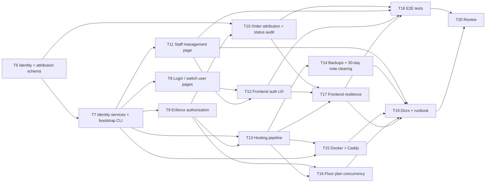

# Plan: Production readiness for TableIt
Status: draft
Version: 2

## Goal
TableIt runs unattended on an on-prem box in one restaurant. Every person signs in with their own account (username + short PIN) and has a role (Staff, Kitchen or Manager), and each order records who took it and who changed its status. Data survives upgrades through EF Core migrations and nightly backups, order notes are cleared after a configurable 30 days, and the app ships as a Docker + Caddy deployment with HTTPS, health checks, logs, CI, and an operations runbook.

## Decisions
User answers to the Version 1 open questions:
1. **Hosting: on-prem.** A mini PC or NAS in the restaurant, running Docker on the LAN behind Caddy for HTTPS (internal CA, or a real domain with a DNS challenge).
2. **Sign-in: individual staff accounts** with ASP.NET Core Identity, not shared PINs. Each order records who took it.
3. **One restaurant per installation.** No multi-tenancy.
4. **No payments.** Orders only; billing stays on the existing till, so prices stay as they are (`decimal`).
5. **Status transitions: option A** (forward flow plus one-step undo). Already implemented in T2.
6. **Note retention:** clear `Order.Note` and `OrderLine.Note` on orders older than 30 days, keeping the rest of the order. The period is configurable (`Retention:NoteDays`, default 30).
7. **Database: keep SQLite.** WAL mode is already on (T4); backups are added in T14.

## Assumptions
- **Base branch.** T1–T5 are done in PR #8 (`feat/production-readiness`, not merged yet), so T6 onwards branch from `feat/production-readiness`, or from `main` once PR #8 is merged.
- **Baseline.** Build and test with `dotnet build TableIt.sln` and `dotnet test TableIt.sln`. CI (`.github/workflows/ci.yml`) runs the same commands. EF tooling comes from the local tool manifest (`.config/dotnet-tools.json`): `dotnet tool restore && dotnet ef ...`. There is no separate linter, so build warnings count as lint.
- **Identity fits the current DbContext** (checked on `feat/production-readiness`):
  - `TableItDbContext` derives from plain `DbContext` and its `OnModelCreating` does not call `base`. Switching it to `IdentityDbContext<StaffUser, IdentityRole, string>` only requires adding `base.OnModelCreating(modelBuilder)` as the first line.
  - The table names `Tables`, `MenuItems`, `Orders` and `OrderLines` do not clash with the `AspNet*` Identity tables.
  - The UTC converter is configured per property, so it does not affect Identity's `DateTimeOffset LockoutEnd` (SQLite stores it as TEXT, and Identity never orders by it).
  - The constructor signature stays the same, so `TestDb` and `TableItFactory` keep working.
  - `MigrationTests.Migrate_OnEmptyFile_CreatesSchemaMatchingTheModel` will catch a forgotten migration.
  - New package needed: `Microsoft.AspNetCore.Identity.EntityFrameworkCore` 8.0.*.
- **Recommended sign-in design for a busy floor** (the default unless open question 1 or 2 changes it):
  - **Credentials.** Identity username plus a numeric PIN used as the password. The password policy allows digits only, minimum length `Auth:MinPinLength` (default 4), with no complexity rules.
  - **Lockout.** Identity lockout after 5 failed attempts for 5 minutes, plus a per-IP rate limit on the login POST.
  - **Cookie.** HttpOnly, SameSite=Strict, Secure, 12-hour sliding expiry.
  - **Fast revocation.** `SecurityStampValidatorOptions.ValidationInterval` of 1 minute, so deactivating a user or resetting their PIN signs them out everywhere within a minute.
  - **Shared devices.** A prominent "Switch user" action signs out and opens the login page with the user picker. Optional idle sign-out via `Auth:IdleSignOutMinutes` (default 0, which means off).
  - **Kitchen screen.** The kitchen display can be signed in as an ordinary Kitchen-role account for the whole night. Status changes are then attributed to that account, which is acceptable.
- **Bootstrapping the first Manager** (recommended): a CLI command, `dotnet TableItWeb.dll create-manager --username <name> --display-name "<name>"` (in Docker: `docker compose run --rm app create-manager ...`).
  - It prompts for the PIN on stdin, which also accepts piped input for scripting.
  - It refuses to run if an active Manager already exists, unless `--reset-pin` is given (`--reset-pin` is the lock-out recovery path).
  - There is no hard-coded default password anywhere.
  - In Development only, when `Seed:DemoData=true`, demo users with documented throwaway PINs are seeded.
- **Role matrix** (Manager implies the other two roles):
  - Staff: read orders, tables and menu; place orders; set status to Served or Cancelled.
  - Kitchen: read orders and menu; any allowed status transition; the `/Kitchen` page.
  - Manager: menu writes, the floor plan, staff management, `/Kitchen/Menu`, `/Kitchen/Planner` and `/Manager/Staff`.
- **Attribution.** Orders get `CreatedByUserId` (string, nullable for older orders) and `CreatedByName` (a snapshot of the display name), in the same way `TableNumber` and line names are snapshotted.
  - Status changes are stored in a new `OrderStatusChanges` table (OrderId, From, To, UserId, UserName, At) and also logged.
  - Staff accounts are deactivated, never deleted, so these references and names stay valid.
- **Migrations.** Only T6 changes the schema in this version. Any later schema change must add its own migration, and tasks that touch `Migrations/` never share a wave.
- **README.** Only T19 edits `README.md`.
- **Backlog, out of scope for this plan:** bills and payments, customer self-ordering, reservations, multiple floors, kitchen printers, Danish UI translation, end-of-day reports, editing order lines after sending, PWA install, and a UI for browsing the status audit trail (the data is recorded now).
- **Task renumbering.** T6–T16 from Version 1 are renumbered: old T6–T8 (shared-PIN auth) become T6–T12 (Identity), and old T9→T13, T10→T14, T11→T15, T14→T16, T15→T17, T16→T18, T13→T19, T12→T20.

## Open questions
1. How does a user pick their account on the login screen?
   Options: A) A grid of active staff display names to tap, then a PIN keypad. B) Type the username, then the PIN.
   Recommended: A, because it is the fastest flow on a shared tablet mid-service. The names are only visible on the restaurant LAN over HTTPS. It can be switched off with `Auth:ShowUserPicker=false`, which falls back to B. This affects T8.
2. Are staff phones personal or shared house devices?
   Options: A) Mostly personal: 12-hour sliding session, manual "Switch user", idle sign-out off by default. B) Shared house devices: also enable idle sign-out after 10 minutes by default.
   Recommended: A, because forced sign-outs mid-service cost time, and B is a one-line config change (`Auth:IdleSignOutMinutes`). This affects the T7 defaults and T12.
3. Minimum PIN length?
   Options: A) 4 digits, with lockout and IP rate limiting. B) 6 digits.
   Recommended: A, because 5 attempts per 5 minutes over a LAN makes guessing impractical, and 4 digits is quicker to enter. Configurable through `Auth:MinPinLength`. This affects the T7 default only.

## Tasks
### T1: Input validation and limits on the API (must-have)
- [x] Done (PR #8)
- Agent: implementer
- Delivered:
  - DataAnnotations limits on menu, table and order payloads, and `[MaxLength]` on entity strings.
  - Removing a table with open orders is rejected.
  - Deviation: a `DeferModelErrors` filter in `TablesController` keeps two older plain-text 400 responses. Optional cleanup is scheduled in T16.

### T5: CI pipeline (must-have)
- [x] Done (PR #8)
- Agent: implementer
- Delivered: `.github/workflows/ci.yml` builds and tests on pushes and PRs to main.

### T2: Order status rules and idempotent order placement (must-have)
- [x] Done (PR #8)
- Agent: implementer
- Delivered:
  - The Decision 5 transition table; illegal transitions return 409.
  - `ClientRequestId` on `CreateOrderRequest` and `Order`, with a unique index. A repeat returns the existing order with 200, a new order returns 201, and `staff.js` sends one ID per draft.
  - Known edge case, handled in T17: if a send that timed out actually succeeded and the draft is then edited, the retry returns the original order and the edit is silently lost.

### T3: Configurable restaurant time zone and service day start (must-have)
- [x] Done (PR #8)
- Agent: implementer
- Delivered:
  - `ServiceDay.StartUtc(TimeZoneInfo, startHour)` and `ServiceDay.Resolve(IConfiguration)`, reading `Restaurant:TimeZone` and `Restaurant:ServiceDayStartHour`.
  - Deviation: an invalid zone or hour only fails at the first request. A startup check is added in T13.

### T4: EF Core migrations, database configuration and seeding policy (must-have)
- [x] Done (PR #8)
- Agent: implementer
- Delivered:
  - The `InitialCreate` migration in `src/TableItWeb/Data/Migrations`, with `Database.Migrate()` on startup.
  - The `Seed:DemoData` switch (true only in Development).
  - WAL mode and `Default Timeout=5`, the `Restaurant` config section, a local `dotnet-ef` tool manifest, and `MigrationTests`.

### T6: Identity and attribution data model with migration (must-have)
- [ ] Not done
- Agent: implementer
- Depends on: none (T1–T5 are done)
- Files: src/TableItWeb/TableItWeb.csproj, src/TableItWeb/Data/StaffUser.cs (new), src/TableItWeb/Data/TableItDbContext.cs, src/TableItShared/Models/Order.cs, src/TableItShared/Models/OrderStatusChange.cs (new), src/TableItWeb/Data/Migrations/* (new migration plus snapshot), tests/TableItWeb.Tests/Controllers/MigrationTests.cs, tests/TableItWeb.Tests/Data/IdentitySchemaTests.cs (new)
- Do:
  - Add `Microsoft.AspNetCore.Identity.EntityFrameworkCore` 8.0.*.
  - Add `StaffUser : IdentityUser` with `DisplayName` (required, at most 100 characters), `IsActive` (default true) and `CreatedAt`.
  - Change `TableItDbContext` to `IdentityDbContext<StaffUser, IdentityRole, string>` and call `base.OnModelCreating(modelBuilder)` first.
  - Add `Order.CreatedByUserId` (string?, at most 450) and `Order.CreatedByName` (string?, at most 100).
  - Add the `OrderStatusChange` entity (Id, OrderId FK with cascade delete, From and To as string-converted enums, `UserId?`, `UserName?` at most 100, `At` as UTC using the existing converter pattern) and a `DbSet<OrderStatusChange> OrderStatusChanges`, indexed on OrderId.
  - Create the migration `AddIdentityAndOrderAttribution` with `dotnet tool restore && dotnet ef migrations add AddIdentityAndOrderAttribution --project src/TableItWeb --output-dir Data/Migrations`.
  - No service wiring and no controller changes.
- Done when: the migration applies cleanly on top of `InitialCreate`, both on an empty DB and on a DB that already has orders (old orders get null attribution). `MigrationTests` still reports no pending model changes, and all existing tests pass.
- Verify: `dotnet test TableIt.sln && dotnet tool restore && dotnet ef migrations has-pending-model-changes --project src/TableItWeb`

### T7: Identity services, cookie auth, roles and Manager bootstrap command (must-have)
- [ ] Not done
- Agent: implementer
- Depends on: T6
- Files: src/TableItWeb/Program.cs, src/TableItWeb/Auth/AuthSetup.cs (new; `AddTableItAuth` extension), src/TableItWeb/Auth/Roles.cs (new; role names and policy names), src/TableItWeb/Auth/StaffSignInManager.cs (new), src/TableItWeb/Auth/StaffClaimsFactory.cs (new), src/TableItWeb/Auth/RoleSeeder.cs (new), src/TableItWeb/Auth/CreateManagerCommand.cs (new), src/TableItWeb/Data/SeedData.cs, src/TableItWeb/appsettings.json, src/TableItWeb/appsettings.Development.json, tests/TableItWeb.Tests/Auth/AuthSetupTests.cs (new), tests/TableItWeb.Tests/Auth/CreateManagerCommandTests.cs (new)
- Do:
  - Register `AddIdentity<StaffUser, IdentityRole>().AddEntityFrameworkStores<TableItDbContext>()`.
  - Password policy: digits only, length at least `Auth:MinPinLength` (default 4) and at most 8. Lockout after 5 failed attempts for 5 minutes, also enabled for new users. Unique usernames.
  - `StaffSignInManager.CanSignInAsync` returns false when `IsActive` is false.
  - `StaffClaimsFactory` adds a `display_name` claim.
  - Application cookie:
    - Login path `/Account/Login` and access-denied path `/Account/AccessDenied`.
    - HttpOnly, SameSite=Strict, Secure policy `SameAsRequest` (TLS is terminated at Caddy; T13 adds forwarded headers).
    - 12-hour sliding expiry, configurable through `Auth:SessionHours`.
    - For requests under `/api` or `/hubs`, `OnRedirectToLogin` and `OnRedirectToAccessDenied` return 401 and 403 instead of redirecting.
  - Security stamp validation interval of 1 minute.
  - Persist Data Protection keys to `DataProtection:KeysPath` when it is set (default: no override in Development).
  - Policies `StaffAccess` (Staff, Kitchen or Manager), `KitchenAccess` (Kitchen or Manager) and `ManagerAccess` (Manager). Register them, but do NOT add a fallback policy or attributes; T9 enforces them.
  - Register a rate-limiter policy named `login` (fixed window, 10 per minute per IP) for T8 to apply.
  - Call `UseAuthentication()` before `UseAuthorization()`.
  - At startup, after `Migrate()`, idempotently create the three roles.
  - `CreateManagerCommand`:
    - Program.cs checks `args[0] == "create-manager"`, runs migrations, runs the command and exits without starting Kestrel.
    - Arguments: `--username`, `--display-name`, optional `--reset-pin`. The PIN is read from stdin, so piped input works.
    - It refuses if an active Manager exists, unless `--reset-pin` is given and the target user exists. On reset it also unlocks the user and updates the security stamp. Exit codes are non-zero on errors.
  - In `SeedData` (Development only, when `Seed:DemoData` is true), seed the users `manager`, `waiter` and `chef` with PIN `1234` and a matching role each. Document this in appsettings.Development.json.
  - Add an `"Auth": { "MinPinLength": 4, "SessionHours": 12, "IdleSignOutMinutes": 0, "ShowUserPicker": true }` section to appsettings.json.
- Done when: the tests show that roles are seeded, `create-manager` creates exactly one Manager and refuses a second, `--reset-pin` works, an inactive user cannot sign in, the 6th wrong PIN locks the account, and an anonymous `/api` call is still allowed (enforcement comes in T9). All existing tests pass.
- Verify: `dotnet test TableIt.sln`

### T8: Sign-in, sign-out and switch-user pages (must-have)
- [ ] Not done
- Agent: implementer
- Depends on: T7
- Files: src/TableItWeb/Pages/Account/Login.cshtml(.cs), src/TableItWeb/Pages/Account/Login.cshtml.css, src/TableItWeb/Pages/Account/Logout.cshtml(.cs), src/TableItWeb/Pages/Account/AccessDenied.cshtml(.cs) (all new), tests/TableItWeb.Tests/Auth/LoginPageTests.cs (new)
- Do:
  - Login page:
    - If `Auth:ShowUserPicker` is true (open question 1), show a grid of active users' display names. Tapping a name opens a large numeric PIN pad with `inputmode="numeric"` and autofocus. Otherwise show a username field.
    - Antiforgery token and `[EnableRateLimiting("login")]` on POST.
    - Uses `PasswordSignInAsync(lockoutOnFailure: true)`.
    - A generic "Wrong name or PIN" message, plus a distinct "Locked, try again in N minutes" message.
    - Only accepts a local `returnUrl` (with its `#hash`), and redirects to `/` otherwise.
  - Logout: POST only. `?switch=1` returns to Login with the picker.
  - AccessDenied: a friendly page with a "Switch user" button.
  - No edits to `_Layout` or `site.css` (T12 owns them). Use scoped CSS.
- Done when: the tests cover a correct PIN signing in with a role claim, a wrong PIN, lockout, an inactive user being rejected, an off-site `returnUrl` being ignored, and the picker listing only active users.
- Verify: `dotnet test TableIt.sln`

### T9: Enforce authorization on API, hub and pages (must-have)
- [ ] Not done
- Agent: implementer
- Depends on: T7
- Files: src/TableItWeb/Controllers/OrderController.cs, src/TableItWeb/Controllers/MenuController.cs, src/TableItWeb/Controllers/TablesController.cs, src/TableItWeb/Hubs/RestaurantHub.cs, src/TableItWeb/Pages/Index.cshtml.cs, src/TableItWeb/Pages/Staff/Index.cshtml.cs, src/TableItWeb/Pages/Kitchen/Index.cshtml.cs, src/TableItWeb/Pages/Kitchen/Menu.cshtml.cs, src/TableItWeb/Pages/Kitchen/Planner.cshtml.cs, tests/TableItWeb.Tests/Infrastructure/* (test auth handler and an authenticated-client helper), tests/TableItWeb.Tests/Integration/*, tests/TableItWeb.Tests/Auth/AuthorizationMatrixTests.cs (new)
- Do:
  - Apply the T7 policies through attributes, following the role matrix in Assumptions:
    - `[Authorize(Policy = StaffAccess)]` on the controllers and the hub, with stricter policies per action (menu writes and `PUT /api/tables` need `ManagerAccess`).
    - `UpdateStatus`: Staff may only set Served or Cancelled; other targets need `KitchenAccess` (403 otherwise).
    - Page models: Index and Staff need `StaffAccess`, `/Kitchen` needs `KitchenAccess`, Menu and Planner need `ManagerAccess`.
    - Error and Account pages stay anonymous.
  - Add a header-driven test authentication scheme to `TableItFactory` (for example `X-Test-User` and `X-Test-Role`). Update the integration and SignalR tests to send it.
  - Controller unit tests that construct controllers directly do not need auth changes.
  - Add matrix tests: anonymous gets 401 on `/api/*` and on the hub negotiate, a page request redirects to Login, and the wrong role gets 403.
  - Do not touch Program.cs.
- Done when: nothing except Account, Error, `/healthz` (added later) and static files is reachable anonymously. The matrix tests pass, and the full suite is green.
- Verify: `dotnet test TableIt.sln`

### T11: Manager staff management page (must-have)
- [ ] Not done
- Agent: implementer
- Depends on: T7
- Files: src/TableItWeb/Pages/Manager/Staff.cshtml(.cs) (new), src/TableItWeb/Pages/Manager/Staff.cshtml.css (new), src/TableItWeb/Auth/StaffAdminService.cs (new), tests/TableItWeb.Tests/Auth/StaffAdminServiceTests.cs (new)
- Do:
  - A server-rendered Razor page (form posts with antiforgery) behind `[Authorize(Policy = "ManagerAccess")]`.
  - It lists users (display name, username, role, active, locked) and supports these actions:
    - create a user (username, display name, role, PIN)
    - change role (exactly one of Staff, Kitchen or Manager)
    - deactivate or reactivate
    - reset PIN (which also unlocks the user)
  - Put the logic in `StaffAdminService`:
    - Every change calls `UpdateSecurityStampAsync`, so existing sessions end within the T7 validation interval.
    - Refuse to deactivate or demote the last active Manager.
    - A manager cannot deactivate themselves.
    - No hard deletes.
  - Log every admin action with the acting manager's username.
- Done when: the service tests cover create, role change, deactivate (the user can no longer sign in), reset PIN, and the last-Manager guard, and the page renders for a Manager.
- Verify: `dotnet test TableIt.sln`

### T13: Production hosting pipeline: errors, proxy/HTTPS, headers, health, logging, config check (must-have)
- [ ] Not done
- Agent: implementer
- Depends on: T7, T9
- Files: src/TableItWeb/Program.cs, src/TableItWeb/appsettings.Production.json (new), tests/TableItWeb.Tests/Integration/HostingTests.cs (new)
- Do:
  - **API errors.** Add `AddProblemDetails()`. Unhandled exceptions under `/api` return `application/problem+json` with a traceId, and pages keep `/Error`.
  - **Proxy.** Enable `UseForwardedHeaders` (X-Forwarded-For and X-Forwarded-Proto) when `Hosting:BehindProxy` is true, with the known proxy network configurable. It must run before authentication, so that Secure cookies and the scheme are correct behind Caddy. When behind the proxy, skip `UseHttpsRedirection` and `UseHsts` in the app; Caddy handles them.
  - **Security headers.** `nosniff`, `Referrer-Policy: same-origin`, `X-Frame-Options: DENY`, and the CSP `default-src 'self'; style-src 'self' 'unsafe-inline'; connect-src 'self' ws: wss:; img-src 'self' data:`.
  - **Health check.** An anonymous `/healthz` with a DB check.
  - **Logging.** Concise request logging, plus a JSON console logger in Production.
  - **Startup config check** (the T3 follow-up). Call `ServiceDay.Resolve(configuration)` at startup and fail fast with a clear message if `Restaurant:TimeZone` or `Restaurant:ServiceDayStartHour` is invalid.
  - **appsettings.Production.json.** An `AllowedHosts` placeholder, log levels, and `Hosting:BehindProxy: true`.
  - Tests must use the T9 test auth handler for authenticated endpoints.
- Done when: the tests show that an API exception returns ProblemDetails, `/healthz` returns 200 anonymously, the security headers are present, and an invalid time zone fails at startup.
- Verify: `dotnet test TableIt.sln`

### T10: Record who took each order and who changed its status (must-have)
- [ ] Not done
- Agent: implementer
- Depends on: T6, T9
- Files: src/TableItWeb/Controllers/OrderController.cs, src/TableItWeb/wwwroot/js/kitchen.js, src/TableItWeb/wwwroot/js/staff.js, tests/TableItWeb.Tests/Controllers/OrderAttributionTests.cs (new), tests/TableItWeb.Tests/Controllers/OrderPlacingTests.cs, tests/TableItWeb.Tests/Controllers/OrderStatusTests.cs
- Do:
  - In `CreateOrder`, set `CreatedByUserId` (the NameIdentifier claim) and `CreatedByName` (the `display_name` claim) from `User`.
  - In `UpdateStatus`, insert an `OrderStatusChange` row (from, to, user ID and name, UTC time) in the same `SaveChanges`. A same-status no-op writes no row.
  - Log "Order {Id} {From}->{To} by {UserName}" and "Order {Id} created by {UserName} for table {TableNumber}".
  - Unit tests construct controllers directly, so they must set a `ControllerContext` with a `ClaimsPrincipal`. Add a small helper in the new test file.
  - Show "by {CreatedByName}" on kitchen cards (`kitchen.js`) and in the staff table view (`staff.js`), escaped with `TableIt.escapeHtml`.
- Done when: the tests show the creator is stored and returned in the order JSON, each transition writes exactly one audit row with the acting user, and old orders with null attribution still render.
- Verify: `dotnet test TableIt.sln`

### T12: Frontend auth experience: session expiry, nav, switch user (must-have)
- [ ] Not done
- Agent: implementer
- Depends on: T8, T11
- Files: src/TableItWeb/wwwroot/js/api.js, src/TableItWeb/Pages/Shared/_Layout.cshtml, src/TableItWeb/Pages/Index.cshtml, src/TableItWeb/wwwroot/css/site.css
- Do:
  - **`api.js` errors.** A 401 redirects to `/Account/Login?returnUrl=<path+hash>`, and a 403 shows a "Not allowed for your role" toast.
  - **SignalR.** On a 401 during negotiate or reconnect, stop retrying and redirect.
  - **`_Layout`.** Show the display name and role, a large "Switch user" button (POST to Logout with `switch=1`) and "Sign out". Filter nav links by `User.IsInRole`, and add a "Staff" admin link (`/Manager/Staff`) for Managers.
  - **Index.** Filter the tiles the same way.
  - **Idle sign-out.** If `Auth:IdleSignOutMinutes` is greater than 0, render it into the layout as a data attribute, and have `api.js` start an inactivity timer that posts the sign-out form.
- Done when: by manual check with `dotnet run` (Development demo users), an expired or revoked session on Staff or Kitchen lands on Login and returns to the same page and hash, "Switch user" works in two taps plus the PIN, and the nav matches the role. Existing tests pass.
- Verify: `dotnet build TableIt.sln && dotnet test TableIt.sln`

### T14: Background maintenance: SQLite backups and 30-day note clearing (must-have)
- [ ] Not done
- Agent: implementer
- Depends on: T13
- Files: src/TableItWeb/Program.cs, src/TableItWeb/Services/BackupService.cs (new), src/TableItWeb/Services/RetentionService.cs (new), src/TableItWeb/appsettings.json, tests/TableItWeb.Tests/Services/BackupServiceTests.cs (new), tests/TableItWeb.Tests/Services/RetentionServiceTests.cs (new)
- Do:
  - **`BackupService`** (a `BackgroundService`):
    - Runs daily at `Backup:Time` (default `04:00`, in the restaurant time zone via `ServiceDay.Resolve`).
    - Makes an online backup with `SqliteConnection.BackupDatabase` to `Backup:Directory` as `tableit-YYYYMMDD-HHmm.db`.
    - Prunes files older than `Backup:KeepDays` (default 30).
    - Logs the result. A health check (registered with the T13 health checks) reports Degraded if the last success was more than 48 hours ago.
    - The backup includes the Identity tables, so it holds PIN hashes. The docs must say to protect the backup directory.
  - **`RetentionService`** (Decision 6):
    - Runs daily and sets `Order.Note` and `OrderLine.Note` to null on orders with `CreatedAt` older than `Retention:NoteDays` days (default 30; 0 disables it).
    - Leaves the order, its lines, attribution and audit rows untouched.
    - Is idempotent, and logs the count.
  - Both services expose a testable `RunOnceAsync(now)`, separate from the scheduling loop.
- Done when: the tests show a backup file is created and opens with the expected tables, old backups are pruned, notes are cleared only on orders older than 30 days (and the setting is respected), and everything else on the order is kept.
- Verify: `dotnet test TableIt.sln`

### T15: Docker + Caddy deployment for an on-prem box (must-have)
- [ ] Not done
- Agent: implementer
- Depends on: T13, T7
- Files: Dockerfile (new), .dockerignore (new), deploy/docker-compose.yml (new), deploy/Caddyfile (new), deploy/.env.example (new)
- Do:
  - **Dockerfile.** Multi-stage: build with SDK 8.0, run on aspnet 8.0. Install `tzdata` in the runtime image, which the IANA `Europe/Copenhagen` zone needs. Run as a non-root user on port 8080 with a HEALTHCHECK on `/healthz`. The entrypoint must pass arguments through, so that `docker compose run --rm app create-manager ...` works.
  - **Compose.**
    - The `app` service, plus `caddy` (ports 443 and 80; `tls internal` for LAN-only use, with a commented alternative for a real domain via DNS challenge).
    - A volume for `/data`: `ConnectionStrings__Default=Data Source=/data/tableit.db;Default Timeout=5`, `Backup__Directory=/data/backups`, `DataProtection__KeysPath=/data/keys`.
    - Environment: `Hosting__BehindProxy=true`, `Restaurant__TimeZone`, `AllowedHosts`.
    - `restart: unless-stopped`.
    - `.env.example` holds no secrets, because accounts come from `create-manager`.
  - Use environment variables only; do not edit `appsettings.Production.json`.
- Done when: `docker build` succeeds, `docker compose up` serves the login page over HTTPS through Caddy, `create-manager` works through `compose run`, `/healthz` is healthy, and data and logins survive `docker compose down` and `up`.
- Verify: `docker build -t tableit:local . && docker compose -f deploy/docker-compose.yml config`

### T16: Floor plan optimistic concurrency, plus the DeferModelErrors cleanup (should-have)
- [ ] Not done
- Agent: implementer
- Depends on: T9, T13
- Files: src/TableItWeb/Controllers/TablesController.cs, src/TableItWeb/wwwroot/js/planner.js, tests/TableItWeb.Tests/Controllers/TablesFloorPlannerTests.cs, tests/TableItWeb.Tests/Controllers/ValidationTests.cs
- Do:
  - **Concurrency.**
    - `GET /api/tables` returns an `ETag` (a hash of the ordered layout).
    - `PUT` requires `If-Match` and returns 412 on a mismatch.
    - `planner.js` sends `If-Match`. On a 412 it shows "Floor plan was changed on another device" with a reload button.
    - On a `TablesChanged` event while there are unsaved edits, show a banner. After a SignalR reconnect, reload silently if there are no unsaved edits.
  - **Optional cleanup.** Remove the T1 `DeferModelErrors` filter so all 400s are ValidationProblem JSON (consistent with T13), and update the affected tests and the planner error display.
  - No schema change.
- Done when: the tests show a stale PUT gets 412 and a fresh PUT succeeds, and the floor plan endpoints return only JSON errors.
- Verify: `dotnet test TableIt.sln`

### T17: Frontend resilience for service (should-have)
- [ ] Not done
- Agent: implementer
- Depends on: T10, T12, T13
- Files: src/TableItWeb/wwwroot/js/api.js, src/TableItWeb/wwwroot/js/staff.js, src/TableItWeb/wwwroot/js/kitchen.js, src/TableItWeb/wwwroot/js/menu.js
- Do:
  - **`api.js`.** Parse ProblemDetails and ValidationProblem bodies into readable messages, and expose the response status to callers.
  - **`staff.js`.**
    - Persist the draft, including its `clientRequestId`, to localStorage per table, and clear it on a successful send.
    - Show a "Not sent: retry" state when offline.
    - Handle the T2 edge case: if the draft was edited after a send that failed or timed out, generate a new `clientRequestId`. Also compare the 200 response (an existing order) with the draft, and if the lines or notes differ, warn "This order was already sent earlier; your later changes were not sent" and offer to send the difference as a new order. A 201 is a normal success.
  - **`kitchen.js`.** Use the Screen Wake Lock API while the page is visible, and re-acquire it on `visibilitychange`.
  - **`menu.js`.** Reload after a SignalR reconnect.
- Done when: by manual check, a reload mid-draft restores the draft, the edited-retry case warns instead of silently dropping changes, the kitchen screen stays awake, and validation messages are readable. Existing tests pass.
- Verify: `dotnet build TableIt.sln && dotnet test TableIt.sln`

### T18: Browser end-to-end smoke tests (should-have)
- [ ] Not done
- Agent: implementer
- Depends on: T10, T11, T12, T17
- Files: tests/TableItWeb.E2E/* (new project: Microsoft.Playwright + xUnit), TableIt.sln, .github/workflows/ci.yml
- Do:
  - Start the app on a real Kestrel port with a temp DB. Use `Seed:DemoData=true`, or create users through `StaffAdminService` or `create-manager`.
  - Flows:
    - The Manager signs in and creates the Staff user "Anna" and the Kitchen user "Chef" in `/Manager/Staff`.
    - Anna signs in through the picker and places an order for table 2 with an item note.
    - Chef, in a second browser context, sees the card live with "by Anna" and moves it to Ready.
    - Anna gets the "order ready" toast and marks the order Served.
    - "Switch user" on a shared context works.
    - A deactivated user is signed out within the validation interval (shorten it in the test config).
  - Add a CI job that installs the Playwright browsers and runs these tests.
- Done when: the E2E tests pass locally and in CI.
- Verify: `dotnet test tests/TableItWeb.E2E`

### T19: Production documentation and operations runbook (must-have)
- [ ] Not done
- Agent: implementer
- Depends on: T11, T14, T15, T16, T17
- Files: README.md, docs/operations.md (new)
- Do:
  - **README.**
    - Replace the "delete tableit.db / no migrations" text with the migrations workflow (`dotnet tool restore`, `dotnet ef migrations add`).
    - Document the Development demo users and the PIN `1234`.
    - Add a "Running in production" section linking to the runbook.
    - Update "Not yet implemented" by removing "Login and staff roles".
  - **docs/operations.md.**
    - First-time setup on the mini PC or NAS: Docker, `.env`, time zone, AllowedHosts, and trusting the Caddy internal root CA on staff phones and tablets.
    - Creating the first Manager (`docker compose run --rm app create-manager`).
    - Managing staff: create, deactivate, reset a PIN.
    - Recovering when locked out (`create-manager --reset-pin`).
    - Upgrades: back up first, pull the new image, migrations run on start.
    - Backup location and restore steps.
    - Protecting backups, because they contain PIN hashes and staff names.
    - Note retention (30 days, configurable).
    - Checking `/healthz` and the logs.
    - A mid-service recovery checklist.
    - A privacy note: what is stored (staff accounts, who took which order, allergy notes for up to 30 days), and that staff are deactivated rather than deleted.
- Done when: a new operator can deploy, create a Manager, manage staff, back up, restore and upgrade using only the docs.
- Verify: `test -f docs/operations.md && grep -q "Running in production" README.md && grep -q "create-manager" docs/operations.md`

### T20: Security and production-readiness review (checkpoint)
- [ ] Not done
- Agent: reviewer
- Depends on: T18, T19
- Files: none (read-only)
- Do: Review the full diff against main for:
  - **Authorization.** Every controller action, the hub and every page has a policy, and the anonymous surface is only Account, Error, `/healthz` and static files.
  - **Identity configuration.** PIN policy, lockout, the login rate limit, the security stamp interval, and inactive users blocked.
  - **Cookies and secrets.** Cookie flags and SameSite (CSRF), Data Protection key persistence, and no default or hard-coded credentials outside the Development seed.
  - **`create-manager`.** The guard rails and exit codes.
  - **Staff administration.** The last-Manager guard.
  - **Attribution and audit.** The attribution and audit rows are correct.
  - **Migrations.** The `AddIdentityAndOrderAttribution` migration on a copy of an existing DB.
  - **Backups and retention.** A backup restores cleanly, and the 30-day note clearing works.
  - **Headers.** The CSP does not break any page.
  - **Docker.** Runs as non-root, includes tzdata, and uses persistent volumes.
  - **Docs.** They match the behaviour.

  Run the full test suite, the E2E tests, and a `docker compose up` smoke test. Report the findings as must-fix or nice-to-have.
- Done when: the report is delivered and the must-fix items are filed as follow-up tasks.
- Verify: `dotnet test TableIt.sln`

## Dependency graph (terminal)
```
T1-T5 (done, PR #8)
   |
   v
  T6 ───▶ T7 ──┬──▶ T8 ──────────────┐
   │           ├──▶ T11 ─────────────┴──▶ T12 ──┐
   │           └──▶ T9 ──┬──▶ T13 ──┬──▶ T14 ───┼────────────────┐
   │                     │          ├──▶ T15 ───┼────────────────┤
   │                     │          └──▶ T16 ───┼────────────────┤
   └─────────────────────┴──▶ T10 ──────────────┴──▶ T17 ──┬─────┴──▶ T19 ──┐
                                                           └──▶ T18 ────────┴──▶ T20
(also: T7─▶T13, T7─▶T15, T13─▶T17, T11─▶T18, T12─▶T18, T10─▶T18, T11─▶T19)
```
Exact edges: T7←T6; T8←T7; T9←T7; T11←T7; T10←T6,T9; T13←T7,T9; T12←T8,T11; T14←T13; T15←T13,T7; T16←T9,T13; T17←T10,T12,T13; T18←T10,T11,T12,T17; T19←T11,T14,T15,T16,T17; T20←T18,T19.

## Dependency graph (Mermaid)


## Execution waves
T1–T5 are done (PR #8). Waves continue from there.

| Wave | Tasks (run in parallel) | Waits for |
|------|-------------------------|-----------|
| 1    | T6                      | PR #8 base |
| 2    | T7                      | T6        |
| 3    | T8, T9, T11             | T7        |
| 4    | T10, T12, T13           | T9, T8, T11 |
| 5    | T14, T15, T16, T17      | T13, T10, T12 |
| 6    | T18, T19                | T14, T15, T16, T17 |
| 7    | T20                     | T18, T19  |

File-ownership check:
- **Hot files.** Program.cs is edited by T7 (wave 2), T13 (wave 4) and T14 (wave 5). `Migrations/` is edited only by T6 (wave 1). `appsettings.json` is edited by T7 (wave 2) and T14 (wave 5).
- **Wave 3.**
  - T8 owns `Pages/Account/*`.
  - T9 owns the controllers, the hub, the existing page models, test infra and the Integration tests.
  - T11 owns `Pages/Manager/*` and `Auth/StaffAdminService.cs`.
  - These are disjoint. T11 may read, but not edit, T7's `Auth/*` files.
- **Wave 4.**
  - T10 owns `OrderController`, `kitchen.js`, `staff.js` and the order tests.
  - T12 owns `api.js`, `_Layout`, `Index.cshtml` and `site.css`.
  - T13 owns Program.cs, `appsettings.Production.json` and `HostingTests`.
  - These are disjoint.
- **Wave 5.**
  - T14 owns Program.cs, `Services/*` and `appsettings.json`.
  - T15 owns the Docker and deploy files.
  - T16 owns `TablesController`, `planner.js`, and the floor plan and validation tests.
  - T17 owns `api.js`, `staff.js`, `kitchen.js` and `menu.js`.
  - These are disjoint.
- **Wave 6.** T18 owns the E2E project, the sln and `ci.yml`; T19 owns `README.md` and `docs/`.

## Risks
- **Identity grows the schema and changes the auth surface at once.** T6 isolates the schema (one migration, no behaviour change). T7 wires services without enforcing anything, so the existing suite stays green. T9 enforces, so any test breakage is concentrated in one task that owns the test infrastructure.
- **`TableItDbContext` must call `base.OnModelCreating`** after the switch to `IdentityDbContext`, or the Identity keys are missing and the migration is wrong. T6 must do this, and `MigrationTests` plus the T20 review check it.
- **Short PINs are weak secrets.** This is mitigated by Identity lockout, the per-IP login rate limit, LAN-only exposure over HTTPS, and a configurable minimum length (open question 3). Deactivation and PIN reset take effect within the 1-minute security stamp interval.
- **Lock-out of all Managers.** This is covered by the last-Manager guard in T11 and the `create-manager --reset-pin` recovery path in T7, documented in T19.
- **Data Protection keys not persisted in Docker** would sign everyone out on every container restart. T7 adds `DataProtection:KeysPath`, and T15 mounts it on the `/data` volume.
- **The user picker reveals staff display names before sign-in.** That is acceptable on a LAN-only HTTPS deployment, and it can be turned off (open question 1).
- **The Caddy internal CA must be trusted on every phone and tablet,** or browsers show warnings and the Secure cookie or the WebSocket may fail. T19 documents installing the root certificate. A real domain with a DNS challenge avoids this.
- **Backups contain PIN hashes and staff names.** T14 and T19 call for protecting the backup directory.
- **The CSP could break the pages.** T13 allows inline styles and `ws:`/`wss:`, and the T18 browser tests catch regressions.
- **PR #8 is not merged yet.** If review changes T1–T5, rebase T6 onward. T6 is the only task that depends on the exact schema snapshot, so regenerate its migration if `InitialCreate` changes.
