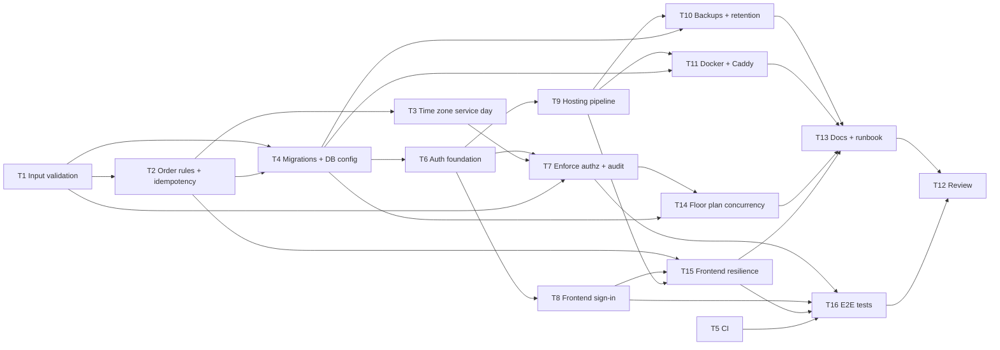

# Plan: Production readiness for TableIt
Status: draft
Version: 1

## Goal
TableIt can run unattended in a real restaurant: only signed-in staff can use it, with role-based access (floor staff, kitchen, manager). Data survives upgrades through EF Core migrations and nightly backups, and bad input or double taps on flaky Wi-Fi cannot corrupt orders. The app ships as a deployable artifact with HTTPS, health checks, useful logs, CI, and an operations runbook.

## Assumptions
- Baseline (checked 2026-10-04 on `feat/order-notes`): `dotnet test TableIt.sln` passes all 77 tests. .NET SDK 8.0.404.
- Build, test and lint commands: `dotnet build TableIt.sln`, `dotnet test TableIt.sln`. There is no separate linter or `dotnet format` config, so build warnings count as lint.
- Gaps found in the code that this plan addresses:
  - **No authentication or authorization.** `Program.cs` calls `UseAuthorization()` but registers no scheme. All `api/*` controllers, the `RestaurantHub` and every page (including `/Kitchen/Menu` and `/Kitchen/Planner`) are anonymous. The README lists "Login and staff roles" as not implemented.
  - **No migrations.** `Program.cs` uses `db.Database.EnsureCreated()`, and the README says "delete it ... after changing the models". Any model change in production would wipe the restaurant's data.
  - **Demo data is seeded in every environment.** `SeedData.Seed` inserts sample tables and a sample menu whenever `Tables` is empty.
  - **The DB path is relative** (`appsettings.json`: `Data Source=tableit.db`), so its location depends on the working directory. There are no backups.
  - **Only partial validation.** `MenuController.Create/Update` accept any name or price (empty, negative, unbounded length). `Order.Note`, `OrderLine.Note`, `Quantity` and the table geometry have no upper bounds. `TablesController.SaveLayout` deletes any table missing from the payload, even one with open orders.
  - **No order status rules.** `OrderController.UpdateStatus` accepts any transition, for example Served → New or Cancelled → Ready.
  - **Order placement is not idempotent.** If a POST times out on weak Wi-Fi and staff press "Send" again, the kitchen gets a duplicate order. `staff.js` only guards against concurrent clicks with the `sending` flag.
  - **Floor plan is last write wins.** `PUT /api/tables` replaces the whole layout, so a stale planner tab can delete tables that another device added.
  - **The service day depends on the server's local time zone.** `ServiceDay.StartUtc` uses `DateTime.Now`. On a UTC container or cloud host, "tonight" would start at 05:00 UTC instead of 05:00 in Denmark.
  - **API errors in production come back as HTML.** `UseExceptionHandler("/Error")` re-executes the Razor error page, and `api.js` then shows that HTML as toast text.
  - **HTTPS is not actually in effect.** The `http` launch profile binds `http://0.0.0.0:5269` with no certificate. `UseHttpsRedirection` has no HTTPS port to redirect to, and HSTS sent over HTTP is ignored. `AllowedHosts` is `*`.
  - **Weak observability.** There is no health endpoint, no request logging, and controllers log nothing.
  - **No CI** (`.github/` does not exist), no Dockerfile or deploy files, and no browser/E2E tests for the ~1,300 lines of page JS.
  - **Frontend resilience gaps.** A reload or phone lock loses the staff draft order (it is held only in memory in `staff.js`). `menu.js` and `planner.js` do not resync after a SignalR reconnect, though `kitchen.js` and `staff.js` do. The kitchen display has no screen wake lock.
  - **Pages use inline `<style>` blocks** (`Pages/Staff/Index.cshtml`, `Pages/Kitchen/*.cshtml`), so a CSP needs `style-src 'unsafe-inline'` or those styles moved to files. Scripts are already external.
- Already done, so not planned: HTML escaping in page JS (`TableIt.escapeHtml`), SignalR auto-reconnect with resync on the kitchen and staff pages, a snapshot of name and price on order lines, locally vendored Bootstrap and SignalR (no CDN dependency on the LAN), basic order validation (table exists, item exists and is available, quantity at least 1), unique table numbers, and seats at least 1.
- Default for open questions until answered: single restaurant per instance, SQLite kept, shared role PINs, on-prem Docker host, no payments.
- Backlog, out of scope for this plan: bills and payments, customer self-ordering, reservations, multiple floors, kitchen printer integration, Danish UI translation, end-of-day sales reports, editing order lines after sending, and installing as a PWA.
- Every task that changes the schema adds its own EF migration after T4, and tasks that touch `Migrations/` never run in the same wave.
- README and docs updates are collected in T13 so that `README.md` has only one owner.

## Open questions
1. Where will TableIt run in production?
   Options: A) On-prem mini PC or NAS in the restaurant, running a Docker container on the restaurant LAN behind a TLS reverse proxy (Caddy). B) A cloud VM or PaaS (e.g. Azure App Service, Fly.io), reached over the internet. C) A bare `dotnet publish` running as a Windows service or systemd service on a restaurant PC.
   Recommended: A, because it keeps working when the restaurant's internet drops, SQLite fits a single box, and the Docker image also runs in the cloud later. It affects T11 and the TLS part of T9.
2. How should staff sign in?
   Options: A) One shared PIN per role (Staff, Kitchen, Manager), set through config or secrets, with a long-lived device cookie. B) Individual staff accounts (ASP.NET Core Identity) with per-person audit ("who took this order"). C) No login; rely on the Wi-Fi password.
   Recommended: A, because it is fast on a busy floor, needs no user admin UI, and can be upgraded to B later. C is not acceptable once the server is reachable beyond a trusted LAN. It affects T6, T7 and T8.
3. Single restaurant or multi-tenant?
   Options: A) One instance and one database per restaurant. B) A multi-tenant SaaS with a tenant ID on every entity.
   Recommended: A, because B touches every model, query and SignalR group and isn't needed to launch.
4. Will TableIt handle bills or payments at launch?
   Options: A) No. Orders only, and payment stays on the existing POS. B) Yes, bills and payments.
   Recommended: A. With B, prices currently stored as `double` (`TableItDbContext` `HasConversion<double>()`) should become integer øre, and Danish bookkeeping and receipt rules apply. That would add a separate plan.
5. Which order status transitions are allowed?
   Options: A) A strict forward flow plus undo of one step: New → InProgress or Cancelled; InProgress → Ready, New or Cancelled; Ready → Served, InProgress or Cancelled; Served → Ready (undo a mis-tap); Cancelled is final. B) Forward-only with no undo. C) Keep today's "anything goes".
   Recommended: A, because kitchens mis-tap on touch screens and the current UI has no undo path. It affects T2.
6. How long should order notes be kept? They can contain health data such as allergies, which is a GDPR special category.
   Options: A) Remove notes from orders older than 90 days and keep the rest of the order. B) Delete whole orders after N months. C) Keep everything.
   Recommended: A, because it limits sensitive data while keeping order history, and it can be configured off. It affects T10.
7. Which database should production use?
   Options: A) Keep SQLite, with WAL mode, a busy timeout and scheduled online backups. B) Move to PostgreSQL.
   Recommended: A for a single restaurant (writes are a handful per minute). Revisit if multi-tenant (question 3 B) or cloud hosting with several instances is chosen.

## Tasks
### T1: Input validation and limits on the API (must-have)
- [ ] Not done
- Agent: implementer
- Depends on: none
- Files: src/TableItShared/Models/MenuItem.cs, src/TableItShared/Models/Table.cs, src/TableItShared/Models/Order.cs, src/TableItShared/Models/Dtos.cs, src/TableItWeb/Controllers/MenuController.cs, src/TableItWeb/Controllers/TablesController.cs, tests/TableItWeb.Tests/Controllers/ValidationTests.cs (new)
- Do: Add DataAnnotations, which `[ApiController]` turns into automatic 400 ValidationProblem responses:
  - MenuItem: Name required, at most 100 characters. Category required, at most 50. Description at most 500. Price from 0 to 100000.
  - Notes on `CreateOrderRequest` and `CreateOrderLine`: at most 500 characters.
  - Quantity: 1 to 99. Lines: 1 to 50 per order.
  - Table: Number 1 to 999, Seats 1 to 50, Width and Height 20 to 1000, X and Y inside the 1000x700 canvas, Rotation 0 to 360.
  - Also apply `[MaxLength]` to the entity string properties so the T4 baseline migration captures them.
  - In `TablesController.SaveLayout`, reject (400, with a clear message) removing a table that has orders in status New, InProgress or Ready tonight.
  - Trim whitespace-only names.
- Done when: invalid menu, table and order payloads return 400 with field errors. Deleting a table with open orders is rejected. All existing tests still pass, and new tests cover each rule.
- Verify: `dotnet test TableIt.sln`

### T5: CI pipeline (must-have)
- [ ] Not done
- Agent: implementer
- Depends on: none
- Files: .github/workflows/ci.yml (new)
- Do: Add a GitHub Actions workflow on push and pull_request to main. Use `actions/setup-dotnet` (8.0.x), then run `dotnet restore`, `dotnet build TableIt.sln -c Release -warnaserror` (if existing warnings make that fail, drop `-warnaserror` and note it in the PR) and `dotnet test TableIt.sln -c Release --no-build`. Cache NuGet packages.
- Done when: the workflow file is valid YAML and the same commands pass locally.
- Verify: `dotnet build TableIt.sln -c Release && dotnet test TableIt.sln -c Release --no-build`

### T2: Order status rules and idempotent order placement (must-have)
- [ ] Not done
- Agent: implementer
- Depends on: T1
- Files: src/TableItWeb/Controllers/OrderController.cs, src/TableItShared/Models/Order.cs, src/TableItShared/Models/Dtos.cs, src/TableItWeb/Data/TableItDbContext.cs, src/TableItWeb/wwwroot/js/staff.js, tests/TableItWeb.Tests/Controllers/OrderStatusTests.cs, tests/TableItWeb.Tests/Controllers/OrderPlacingTests.cs
- Do:
  - Add an allowed-transition table (per open question 5, default option A). `UpdateStatus` returns 409 Conflict with a message on an illegal transition and treats a same-status update as a no-op 200.
  - Add an optional `Guid? ClientRequestId` to `CreateOrderRequest` and to `Order`, with a unique index in `TableItDbContext`. If an order with that ID already exists, return it (200) instead of creating a duplicate.
  - In `staff.js`, generate the ID with `crypto.randomUUID()` once per draft (fall back to a random string), and reuse it when the user retries.
- Done when: illegal transitions get 409, and posting the same ClientRequestId twice yields one order and one `OrderCreated` broadcast. Tests cover both.
- Verify: `dotnet test TableIt.sln`

### T3: Configurable restaurant time zone and service day start (must-have)
- [ ] Not done
- Agent: implementer
- Depends on: T2
- Files: src/TableItWeb/Services/ServiceDay.cs, src/TableItWeb/Controllers/OrderController.cs, tests/TableItWeb.Tests/Controllers/ServiceDayTests.cs, tests/TableItWeb.Tests/Controllers/OrderReadingTests.cs
- Do: Change `ServiceDay.StartUtc` to take a `TimeZoneInfo` and a start hour instead of relying on `DateTime.Now` or `DateTimeKind.Local`. `OrderController` reads `Restaurant:TimeZone` (IANA ID, default `Europe/Copenhagen`) and `Restaurant:ServiceDayStartHour` (default 5) from injected `IConfiguration`, falling back to the defaults if they are missing. Do not edit appsettings.json; T4 adds the keys. Update the tests that construct `OrderController` directly. Add tests for the DST change days and a UTC host.
- Done when: "tonight" is correct regardless of the server's OS time zone, and the tests prove it.
- Verify: `dotnet test TableIt.sln`

### T4: EF Core migrations, database configuration and seeding policy (must-have)
- [ ] Not done
- Agent: implementer
- Depends on: T1, T2
- Files: src/TableItWeb/TableItWeb.csproj, src/TableItWeb/Program.cs, src/TableItWeb/Data/TableItDbContext.cs, src/TableItWeb/Data/SeedData.cs, src/TableItWeb/Data/Migrations/* (new), src/TableItWeb/appsettings.json, src/TableItWeb/appsettings.Development.json, tests/TableItWeb.Tests/Controllers/SeedDataTests.cs, tests/TableItWeb.Tests/Infrastructure/TableItFactory.cs
- Do:
  - Add `Microsoft.EntityFrameworkCore.Design` 8.0.* and create an `InitialCreate` migration from the current model. Replace `EnsureCreated()` with `Database.Migrate()`.
  - Document how to adopt an existing `tableit.db` that was made by EnsureCreated: either baseline it by inserting into `__EFMigrationsHistory`, or note that dev databases must be recreated once.
  - Set the SQLite connection to WAL mode with a busy timeout (`Default Timeout=5`, plus `PRAGMA journal_mode=WAL` at startup).
  - Seed demo data only when `Seed:DemoData` is true. Set it to true in Development and false in appsettings.json. In production, an empty database should start with an empty menu and an empty floor plan.
  - Add a `"Restaurant": { "TimeZone": "Europe/Copenhagen", "ServiceDayStartHour": 5 }` section to appsettings.json.
  - Make the connection string overridable by an environment variable (this already works through `ConnectionStrings__Default`).
  - Keep `TestDb` on EnsureCreated, but add one test that `Migrate()` on an empty file gives a schema matching the model (no pending model changes).
- Done when: the app starts on a fresh file through migrations, `dotnet ef migrations has-pending-model-changes` reports none, the existing tests pass, and production config seeds nothing.
- Verify: `dotnet test TableIt.sln && dotnet tool run dotnet-ef migrations has-pending-model-changes --project src/TableItWeb || dotnet ef migrations has-pending-model-changes --project src/TableItWeb`

### T6: Authentication foundation: role sign-in (must-have)
- [ ] Not done
- Agent: implementer
- Depends on: T4
- Files: src/TableItWeb/Program.cs, src/TableItWeb/Auth/* (new: options, PIN verification service, policy names), src/TableItWeb/Pages/Login.cshtml(.cs) (new), src/TableItWeb/Pages/Logout.cshtml(.cs) (new), src/TableItWeb/appsettings.json, src/TableItWeb/appsettings.Development.json, tests/TableItWeb.Tests/Auth/LoginTests.cs (new)
- Do: Based on open question 2 (default A):
  - Set up cookie authentication with roles Staff, Kitchen and Manager. Manager implies the Kitchen and Staff permissions.
  - Store PINs as `PasswordHasher` hashes under `Auth:Roles:{Role}:PinHash`, supplied by environment or user-secrets. Never commit real hashes. Dev gets documented throwaway PINs in appsettings.Development.json. Add a small `--hash-pin` CLI switch or doc snippet to generate hashes.
  - Cookie settings: HttpOnly, SameSite=Strict, Secure when the request is HTTPS, sliding expiry 12h (configurable).
  - Persist Data Protection keys to a configurable directory (`DataProtection:KeysPath`) so logins survive restarts and container recreation.
  - Rate-limit POST /Login per IP with `AddRateLimiter` (for example 5 per minute).
  - Use antiforgery on the Login form.
  - Define policies (`StaffAccess`, `KitchenAccess`, `ManagerAccess`) but do not apply them yet; T7 does that.
- Done when: a correct PIN signs in with the right role claim, a wrong PIN returns an error, the login endpoint is rate-limited, and the tests cover all three.
- Verify: `dotnet test TableIt.sln`

### T7: Enforce authorization on API, hub and pages, plus an audit log (must-have)
- [ ] Not done
- Agent: implementer
- Depends on: T6, T3, T1
- Files: src/TableItWeb/Controllers/OrderController.cs, src/TableItWeb/Controllers/MenuController.cs, src/TableItWeb/Controllers/TablesController.cs, src/TableItWeb/Hubs/RestaurantHub.cs, src/TableItWeb/Pages/Index.cshtml.cs, src/TableItWeb/Pages/Staff/Index.cshtml.cs, src/TableItWeb/Pages/Kitchen/*.cshtml.cs, tests/TableItWeb.Tests/Infrastructure/* (test auth handler), tests/TableItWeb.Tests/Integration/*, tests/TableItWeb.Tests/Auth/AuthorizationTests.cs (new)
- Do: Apply the T6 policies:
  - Staff: GET orders, tables and menu; POST orders; PATCH status only to Served or Cancelled.
  - Kitchen: GET orders and menu; PATCH any allowed transition; the `/Kitchen` page.
  - Manager: menu writes, PUT tables, `/Kitchen/Menu` and `/Kitchen/Planner`.
  - Hub: `[Authorize]`.
  - The API returns 401 or 403 (not a login redirect) for `/api/*` and the hub. Configure this through cookie events in T6's options if T6 did not, but keep Program.cs edits out of this task: if needed, ask T6's owner or report it.
  - Add `ILogger` audit entries for order created, status changed, menu changed and layout saved, including the role and order ID.
  - Add a test authentication handler to `TableItFactory` so the integration and SignalR tests run authenticated, and add tests proving that anonymous requests get 401 and wrong-role requests get 403.
- Done when: no endpoint, page or hub is reachable anonymously except Login, Error and static files. The role matrix is covered by tests, and all earlier tests pass.
- Verify: `dotnet test TableIt.sln`

### T8: Frontend sign-in experience (must-have)
- [ ] Not done
- Agent: implementer
- Depends on: T6
- Files: src/TableItWeb/wwwroot/js/api.js, src/TableItWeb/Pages/Shared/_Layout.cshtml, src/TableItWeb/Pages/Index.cshtml, src/TableItWeb/wwwroot/css/site.css
- Do: In `api.js`, a 401 redirects to `/Login?returnUrl=<current page and hash>`, and a 403 shows a "not allowed for your role" toast. The SignalR connection stops retrying on 401 and redirects. `_Layout` shows the signed-in role and a Log out link, and hides nav links the role cannot use (`User.IsInRole`). The Index tiles are filtered the same way. The Login page needs large, phone-friendly PIN input with a numeric keypad (`inputmode="numeric"`).
- Done when: by manual check with `dotnet run`, an expired session on Staff or Kitchen lands on Login and returns to the same page, and the nav matches the role.
- Verify: `dotnet build TableIt.sln && dotnet test TableIt.sln`

### T9: Production hosting pipeline: errors, HTTPS, headers, health, logging (must-have)
- [ ] Not done
- Agent: implementer
- Depends on: T6
- Files: src/TableItWeb/Program.cs, src/TableItWeb/appsettings.Production.json (new), tests/TableItWeb.Tests/Integration/HostingTests.cs (new)
- Do:
  - Add `AddProblemDetails()`. For `/api/*`, unhandled exceptions return a JSON ProblemDetails with a traceId instead of the `/Error` HTML page, and the Razor `/Error` page stays for page requests.
  - Add `UseForwardedHeaders`, enabled by config (`Hosting:BehindProxy`), for running behind Caddy or nginx. Keep HTTPS redirection and HSTS only when not behind a TLS-terminating proxy, or document both modes.
  - Add security headers middleware: `X-Content-Type-Options: nosniff`, `Referrer-Policy: same-origin`, `X-Frame-Options: DENY`, and a CSP of `default-src 'self'; style-src 'self' 'unsafe-inline'; connect-src 'self' ws: wss:; img-src 'self' data:`. Inline `<style>` blocks exist, so `'unsafe-inline'` is needed for styles only.
  - Map `/healthz` with `AddHealthChecks()` and a DB check (anonymous, minimal output).
  - Add `UseHttpLogging` or concise request logging, plus console JSON logging in Production.
  - In appsettings.Production.json: `AllowedHosts` as a placeholder that ops must set, Kestrel endpoint config from environment, and log levels.
- Done when: tests show that an API exception returns `application/problem+json`, `/healthz` returns 200 anonymously, and the security headers are present.
- Verify: `dotnet test TableIt.sln`

### T10: Background maintenance: SQLite backups and note retention (must-have backups, retention per question 6)
- [ ] Not done
- Agent: implementer
- Depends on: T9, T4
- Files: src/TableItWeb/Program.cs, src/TableItWeb/Services/BackupService.cs (new), src/TableItWeb/Services/RetentionService.cs (new), src/TableItWeb/appsettings.json, tests/TableItWeb.Tests/Services/BackupServiceTests.cs (new), tests/TableItWeb.Tests/Services/RetentionServiceTests.cs (new)
- Do:
  - `BackupService` (a `BackgroundService`): daily at a configurable local time (`Backup:Time`, default 04:00 in the restaurant time zone), online backup through `SqliteConnection.BackupDatabase` or `VACUUM INTO` to `Backup:Directory` as `tableit-YYYYMMDD-HHmm.db`. Keep `Backup:KeepDays` (default 30). Log success or failure. The health check reports degraded if the last backup is older than 48h.
  - `RetentionService`: if `Retention:NoteDays` > 0, set `Order.Note` and `OrderLine.Note` to null on orders older than N days (default per question 6). It runs daily and is idempotent.
  - Both services contain a testable method separate from the scheduling loop.
- Done when: the tests show a backup file is created and readable and old backups are pruned, and that notes are cleared only on orders older than the cutoff.
- Verify: `dotnet test TableIt.sln`

### T11: Deployment packaging (must-have; shape depends on question 1)
- [ ] Not done
- Agent: implementer
- Depends on: T9, T4
- Files: Dockerfile (new), .dockerignore (new), deploy/docker-compose.yml (new), deploy/Caddyfile (new), deploy/.env.example (new)
- Do:
  - Multi-stage Dockerfile: build with the SDK 8.0 image, run on aspnet 8.0 as a non-root user, listening on 8080, with a HEALTHCHECK on `/healthz`.
  - Docker Compose with the app plus Caddy for TLS (internal CA for LAN-only use, or a real domain with ACME), and volumes for `/data` (the DB at `Data Source=/data/tableit.db`, backups at `/data/backups`, Data Protection keys at `/data/keys`). Set `Hosting__BehindProxy=true`, `Restaurant__TimeZone`, and PIN hashes from `.env`.
  - Do not edit appsettings.Production.json (T9 owns it); use environment variables only.
- Done when: `docker build` succeeds, `docker compose up` serves the login page over HTTPS through Caddy, `/healthz` is healthy, and data persists across `docker compose down/up`.
- Verify: `docker build -t tableit:local . && docker compose -f deploy/docker-compose.yml config`

### T14: Floor plan optimistic concurrency (should-have)
- [ ] Not done
- Agent: implementer
- Depends on: T7, T4
- Files: src/TableItWeb/Controllers/TablesController.cs, src/TableItWeb/wwwroot/js/planner.js, tests/TableItWeb.Tests/Controllers/TablesFloorPlannerTests.cs
- Do: `GET /api/tables` returns an `ETag` (a hash of the ordered layout). `PUT /api/tables` requires a matching `If-Match` and returns 412 on mismatch. `planner.js` sends `If-Match`. On 412, it tells the user "Floor plan was changed on another device" and offers a reload. On a `TablesChanged` event while there are unsaved local edits, it shows a warning banner. On SignalR reconnect it reloads silently if there are no unsaved edits. No schema change.
- Done when: the tests show a stale PUT gets 412 and a fresh PUT succeeds, and a manual two-tab check works.
- Verify: `dotnet test TableIt.sln`

### T15: Frontend resilience for service (should-have)
- [ ] Not done
- Agent: implementer
- Depends on: T2, T8, T9
- Files: src/TableItWeb/wwwroot/js/api.js, src/TableItWeb/wwwroot/js/staff.js, src/TableItWeb/wwwroot/js/kitchen.js, src/TableItWeb/wwwroot/js/menu.js
- Do:
  - In `api.js`, parse ProblemDetails and ValidationProblem bodies into readable messages instead of raw text.
  - In `staff.js`, persist the in-progress draft (including the ClientRequestId) to localStorage per table, so a reload or phone lock does not lose the order. Clear it on successful send. Show a clear "Not sent: retry" state when offline.
  - In `kitchen.js`, request a Screen Wake Lock (`navigator.wakeLock`) while the page is visible, and re-acquire it on visibilitychange.
  - In `menu.js`, reload the menu after a SignalR reconnect.
- Done when: by manual check, a reload mid-draft restores the draft, the kitchen screen stays on, and validation errors show field messages. Existing tests pass.
- Verify: `dotnet build TableIt.sln && dotnet test TableIt.sln`

### T16: Browser end-to-end smoke tests (should-have)
- [ ] Not done
- Agent: implementer
- Depends on: T7, T8, T15
- Files: tests/TableItWeb.E2E/* (new project, Microsoft.Playwright + xUnit), TableIt.sln, .github/workflows/ci.yml
- Do: Start the app on a Kestrel port with a temp DB and demo seed. Script the flows: log in as Staff, place an order for table 2 with an item note, then log in as Kitchen in a second browser context and see the card appear live. Move the card to Ready, check that Staff sees the "order ready" toast, then mark it Served. Add a Manager flow that toggles menu availability. Add a CI job that installs the Playwright browsers and runs the E2E tests.
- Done when: the E2E tests pass locally and in CI.
- Verify: `dotnet test tests/TableItWeb.E2E`

### T13: Production documentation and operations runbook (must-have)
- [ ] Not done
- Agent: implementer
- Depends on: T10, T11, T14, T15
- Files: README.md, docs/operations.md (new)
- Do:
  - README: replace "Delete it ... there are no migrations yet" with the migrations workflow, add a "Running in production" section linking to the runbook, and update "Not yet implemented" (remove "Login and staff roles").
  - docs/operations.md: first-time setup (generate PIN hashes, set time zone and AllowedHosts, trust the Caddy CA on staff phones if LAN-only), upgrades (pull image, migrations run on start, take a backup first), backup restore steps, rotating PINs (Data Protection keys and sign-out), checking `/healthz` and logs, a recovery checklist for mid-service problems, and the data/privacy note (which data is stored, note retention).
- Done when: a new operator can deploy, back up, restore and upgrade using only the docs.
- Verify: `test -f docs/operations.md && grep -q "Running in production" README.md`

### T12: Security and production-readiness review (checkpoint)
- [ ] Not done
- Agent: reviewer
- Depends on: T13, T16
- Files: none (read-only)
- Do: Review the full diff from main for these points:
  - authorization coverage (every controller action, the hub and the pages)
  - cookie and CSRF settings
  - secrets not committed
  - CSP not breaking pages
  - migration correctness on an existing DB
  - backup and restore actually working
  - idempotency and status rules
  - Docker running as non-root with persistent volumes
  - docs matching the behaviour
  Run the full test suite and a `docker compose up` smoke test. Report the findings as must-fix or nice-to-have.
- Done when: the review report is delivered and its must-fix items are filed as follow-up tasks.
- Verify: `dotnet test TableIt.sln`

## Dependency graph (terminal)
```
T1 ──▶ T2 ──┬──▶ T3 ───────────────┐
            │                      │
            └──▶ T4 ──▶ T6 ──┬──▶ T7 ──┬──▶ T14 ──┐
                 │           │         │          │
                 │           ├──▶ T8 ──┼──────────┼──▶ T15 ──┐
                 │           │         │          │          │
                 │           └──▶ T9 ──┼─▶ T10 ───┤          │
                 │                     │          │          │
                 └─────────────────────┴─▶ T11 ───┴──▶ T13 ──┤
                                                             │
                                         T7,T8,T15 ──▶ T16 ──┴──▶ T12
T5 (CI, independent) ─────────────────────────────────────▶ T16 (edits ci.yml later)
```
(Exact edges: T2←T1; T3←T2; T4←T1,T2; T6←T4; T7←T6,T3,T1; T8←T6; T9←T6; T10←T9,T4; T11←T9,T4; T14←T7,T4; T15←T2,T8,T9; T16←T7,T8,T15 (and T5 by file); T13←T10,T11,T14,T15; T12←T13,T16.)

## Dependency graph (Mermaid)


## Execution waves
| Wave | Tasks (run in parallel) | Waits for |
|------|-------------------------|-----------|
| 1    | T1, T5                  | -         |
| 2    | T2                      | T1        |
| 3    | T3, T4                  | T2        |
| 4    | T6                      | T4        |
| 5    | T7, T8, T9              | T6, T3    |
| 6    | T10, T11, T14, T15      | T9, T7, T8 |
| 7    | T13, T16                | T10, T11, T14, T15, T5 |
| 8    | T12                     | T13, T16  |

File-ownership check per wave:
- Wave 1: T1 owns Models and Menu/Tables controllers; T5 owns .github.
- Wave 3: T3 owns ServiceDay and OrderController; T4 owns Program.cs, DbContext, Migrations and appsettings.
- Wave 5: T7 owns the controllers, hub, page models and test infra; T8 owns api.js, _Layout and Index.cshtml; T9 owns Program.cs and appsettings.Production.json.
- Wave 6: T10 owns Program.cs, Services and appsettings.json; T11 owns Docker and deploy files; T14 owns TablesController and planner.js; T15 owns api.js, staff.js, kitchen.js and menu.js.
- Wave 7: T13 owns README and docs; T16 owns the E2E project, sln and ci.yml.

## Risks
- **Existing `tableit.db` files were created with EnsureCreated and have no migration history.** `Migrate()` would try to re-create the tables. T4 must document or implement a baseline (insert the InitialCreate row when the tables exist but the history table does not). The reviewer (T12) checks this against a copy of a real dev DB.
- **Program.cs is touched by T4, T6, T9 and T10.** They are deliberately placed in separate waves (3, 4, 5, 6). Agents must not edit Program.cs outside their task.
- **Adding auth breaks the 77 existing tests** (integration and SignalR tests call anonymous endpoints). T7 owns the test infrastructure update and must keep the full suite green before finishing.
- **Without HTTPS, PINs and session cookies cross restaurant Wi-Fi in plain text.** T9 and T11 make TLS the default deployment. A LAN-only setup with Caddy's internal CA means installing a root certificate on staff phones, which T13 documents. If that is too much friction, option 1 B (cloud with a real domain) avoids it.
- **The CSP could break the pages** (inline styles, SignalR websockets, Bootstrap data URIs). T9 permits inline styles and `ws:`/`wss:`. T16's browser tests and the T12 review catch regressions.
- **The idempotency key relies on `crypto.randomUUID`,** which requires a secure context (HTTPS) on some mobile browsers. T2 must include a fallback generator.
- **SQLite `double` price storage** (`TableItDbContext`) is fine for display but not for billing. It is out of scope unless open question 4 changes to B.
- **Answers to the open questions can reshape T6, T7, T8 (auth model), T11 (hosting) and T10 (retention).** Those tasks should not start until questions 1, 2 and 6 are answered. Wave 1 to 3 tasks are safe to start now.
